Scanning the binary with DIE shows us that it's packed with UPX

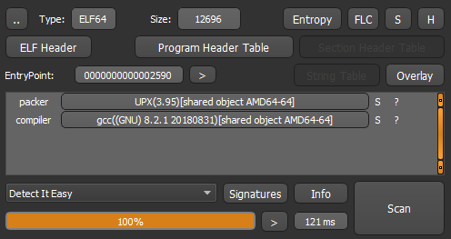

However, none of the UPX unpackers worked on it, so I decided to unpack it manually. I'm going to use radare2 for unpacking. The binary is also protected with an anti-debugger so we must get rid of it first. To do that, we are going to stop at the first ptrace syscall
```
r2 -d ./bugger
dcs ptrace
ds
pd
```

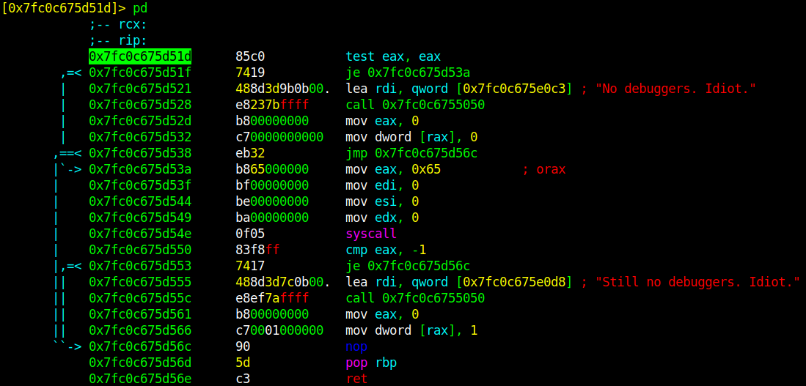

As you can see, `ptrace` is called twice. First call tries to attach to itself and if it can't, it prints **No debuggers. Idiot.** and quits. We can bypass it by setting rax to 0, `dr rax=0`. Second call is expected to return -1 because it already attached to itself(ptrace returns -1 on error). If you try to set eax to 0 again in the second call, it'll print **Still no debuggers. Idiot.** and quit
```
dr rax=0
dc
```
After getting prompted with the "enter the flag" text, hit `Ctrl+C` to stop the process

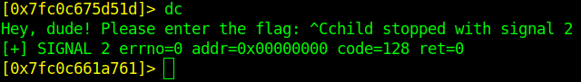

Execute `dm` to see memory regions

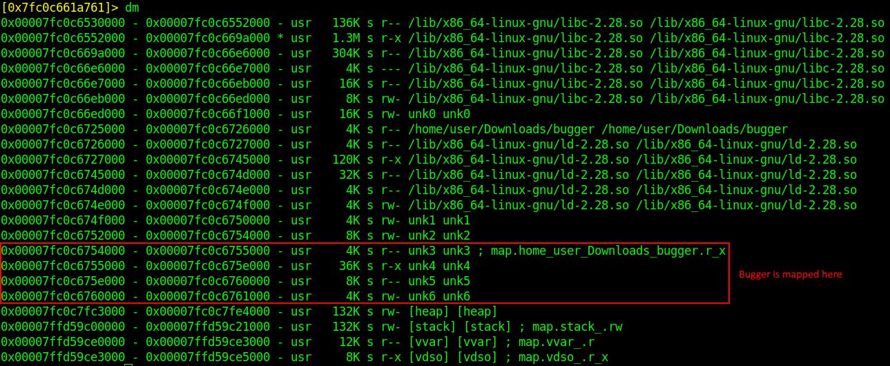

Bugger is mapped to 4 regions, lets confirm it by seeking to the first region and formatting it as elf64 header
```
s 0x00007fc0c6754000
pfo elf64
pf.elf_header
```

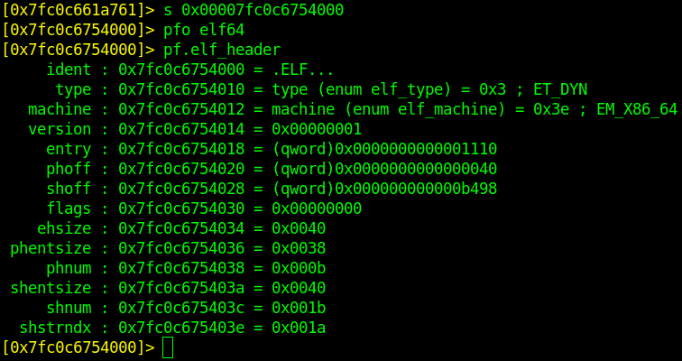

Bingo! It's an elf header, lets see how many `PLT_LOAD` program headers it has got by executing the command  
`pf 9? (elf_phdr)phdr @ $$+0x40!0x200~..`

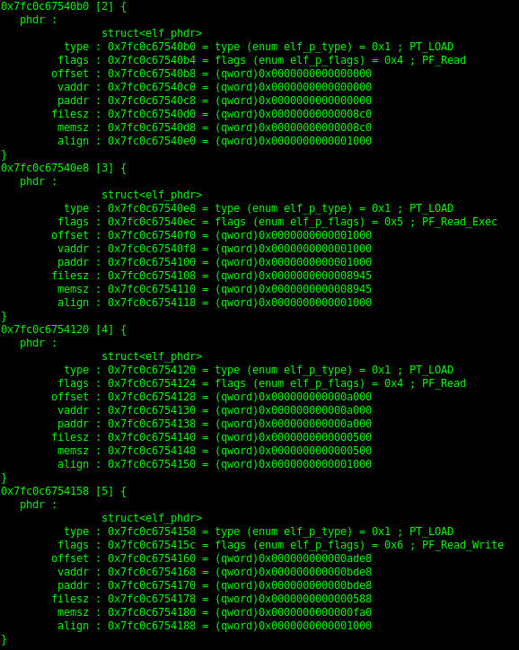

Exactly 4! We are on the right track. You can quit the view by hitting **q** btw. Anyway, lets dump them into a file. We must calculate how many bytes we have to dump first. Subtracting the ending address of the last region from the starting address of the first region gives us the required offset

**0x00007fc0c6761000-0x00007fc0c6754000=0xd000**  
`wtf bugger_dump 0xd000`

Opening the bugger_dump with IDA and selecting the function **sub_9812** will show us the flag check routine

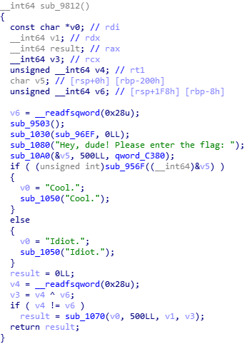

Apparently, **sub_956F** checks our input

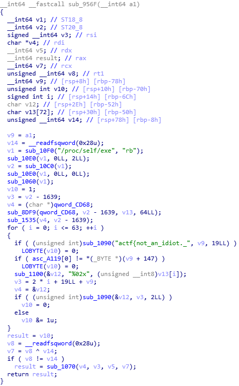

input[147] is compared with **asc_A119**. Lets check what it is

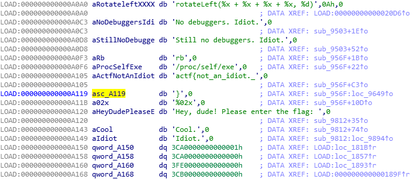

So it's just `}`, end of the input. We can safely assume that our string is 148 bytes long

Our input is also used in **sub_1090**. It's basically `strcmp` with 2 modes: The entire string and two bytes at a time. **sub_1100** is `sprintf`

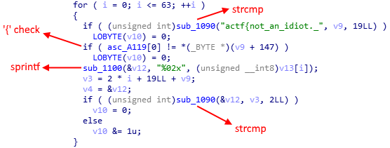

Unfortunately, I couldnt recover both of these functions from the memory so we'll have to switch to debugging  
Data read from `/proc/self/exe` is modified a lot in many functions. We'll save time if we dynamically analize the result. Lets put a breakpoint to the second `strcmp` call at offset **0x96B2**
 
```
s $$+0x96B2
db $$
dc
```
As input, you can input anything, I've used *0123456789012345678901234567890123456789* for this session  
If you single step 9 times after the breakpoint hit, you'll see the 2nd mode of `strcmp` which compares two bytes at once
```
ds;ds;ds;ds;ds;ds;ds;ds;ds
pd
```

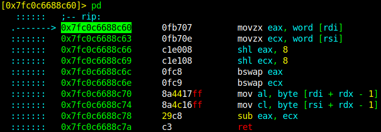

Stepping 2 more times will load `rax` and `rcx` with the 2 bytes of flag and 2 bytes of our input respectively
```
ds;ds
dr
```

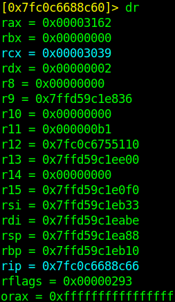

Executing `px @ rsi` will show us our input

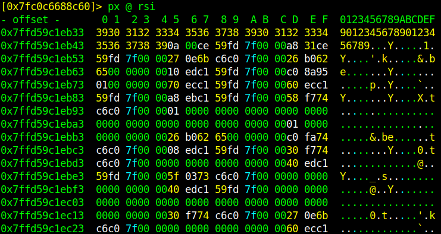

Executing `px @ rdi` will show us the flag

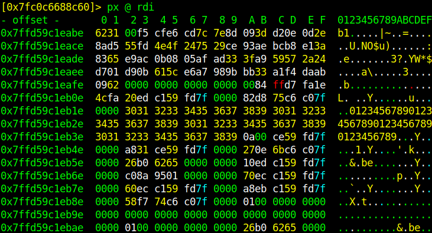

Lets delete the previous breakpoints and put a new breakpoint at here
```
db-*
db $$
dc
px @ rdi
```

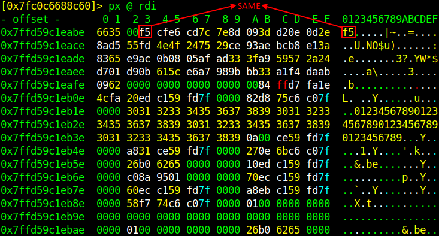

```
dc
px @ rdi
```

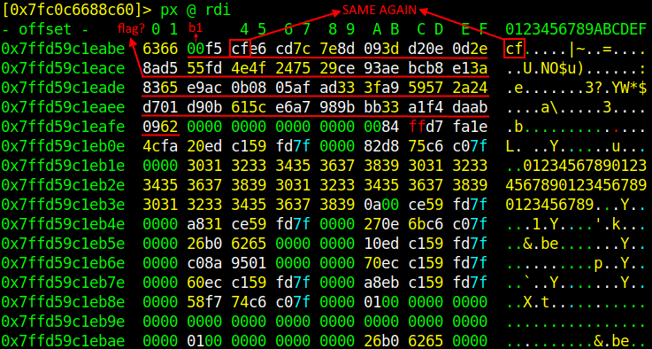

I guess we can say that it's probably the flag, lets combine the 3 parts together and try it out!
**actf{not_an_idiot._b1f5cfe6cd7c7e8d093dd20e0d2e8ad555fd4e4f247529ce93aebcb8e13a8365e9ac0b0805afad333fa959572a24d701d90b615ce6a7989bbb33a1f4daab0962}**


