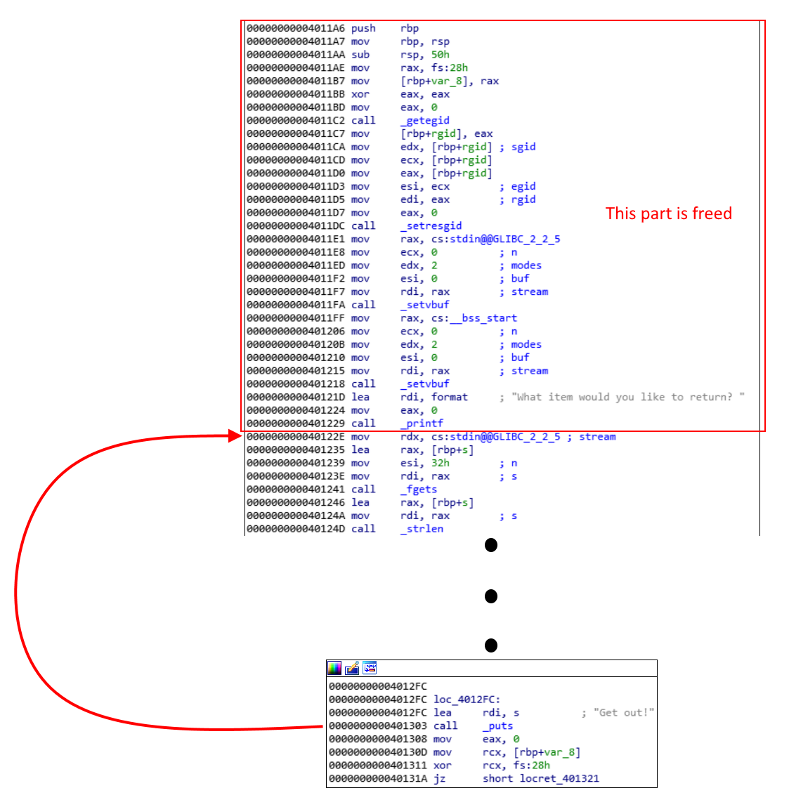

This is basically a x64 format string attack. Our goal is to overwrite the got table with a magic gadget  
However, we got 3 major problems:
1. We can only write to one address per loop due to addresses containing null bytes
   * We can also write 2 bytes at most at once
2. All functions in the got table are used in the main function and we can only modify `puts` at once
   * `puts` is used for looping, thus leaving us no other function to use for magic gadget
3. Magic gadget has a constraint: **rax=NULL**
   * rax is non-zero before the `puts` call

### Solution

1. Modify got entry of `puts` to `0x40122E` so we can free `_getegid`, `_setresgid` and `_setvbuf`

2. Leak the address of `fgets` so we can calculate the libc base
3. Overwrite got entry of `_getegid` with the magic gadget
4. Modify got entry of `puts` to `0x4011BD` to return to `_getegid`. This also satisfies the **rax=NULL** constraint

For the full solution, check [returns.py](returns.py)
