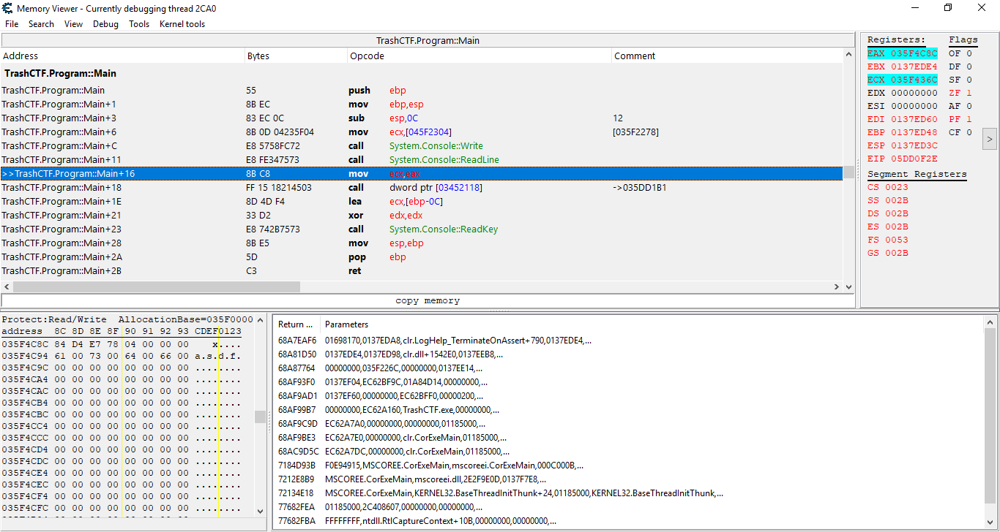
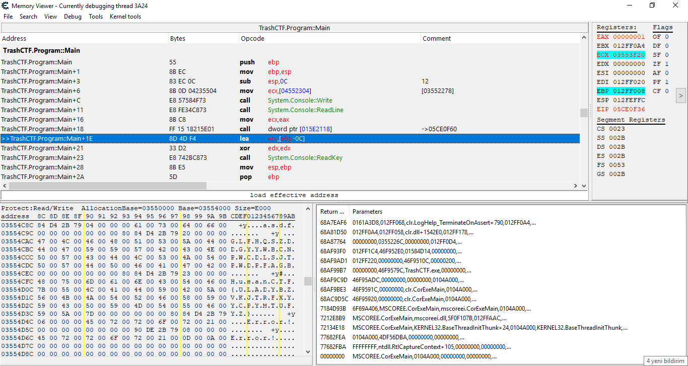
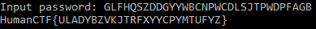

The binary is written in C# so I've decompiled it with dnSpy
  
That funny looking function calls another funny looking one
  
And this goes on and on and on for god knows how many times  
At last, it lands on a function that looks like this  
  
Of course, this isn't the real flag. Actually, there are 10098 of them
  
Continuing with the Cheat Engine from now on  
Put a breakpoint at the line that comes after the `Readline` call to view the string object returned from the `Readline` call  
Returned string object is kept in `eax`, check bottom left window
  
Skipping to the `ReadKey` call, look who is allocated next to our input :smiley:
  
We got the flag!  

