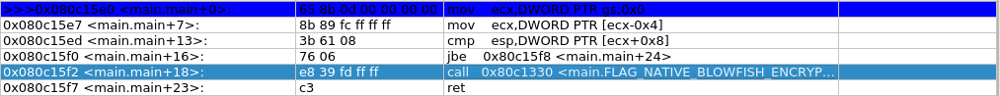
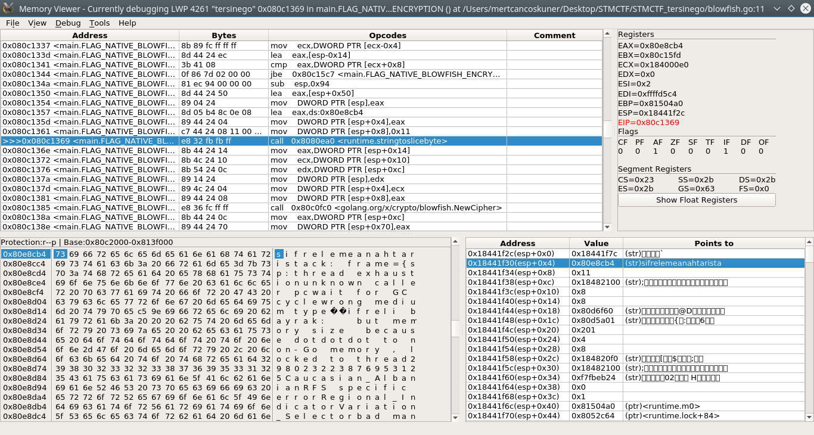
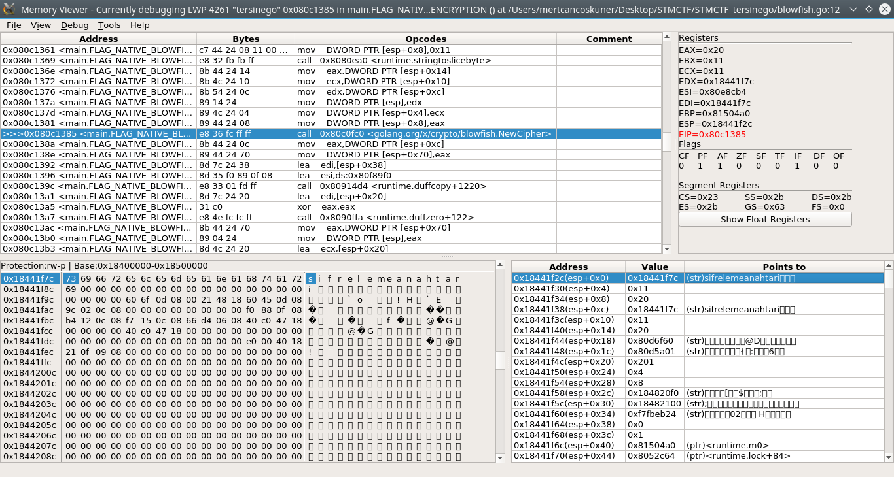
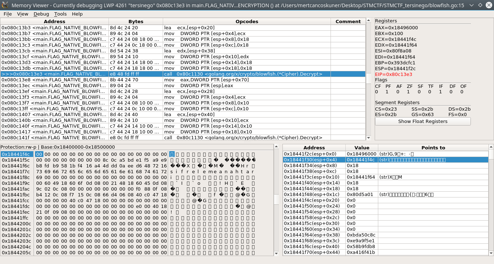
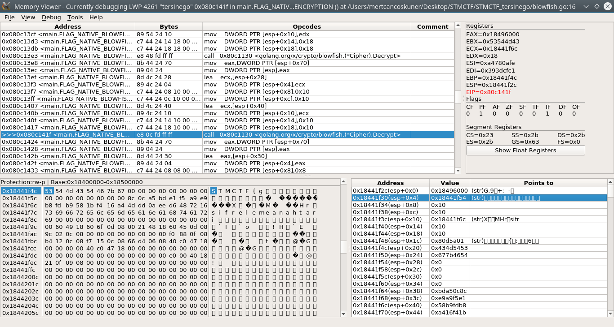
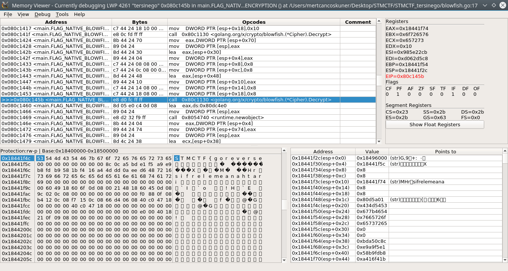
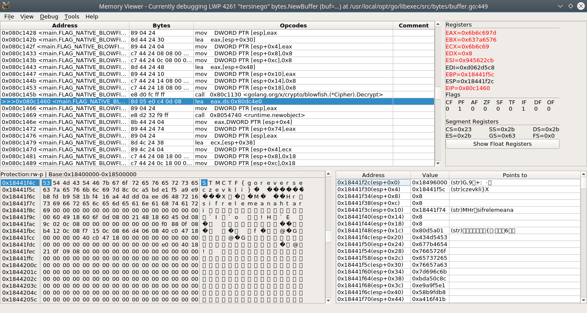
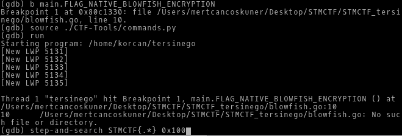
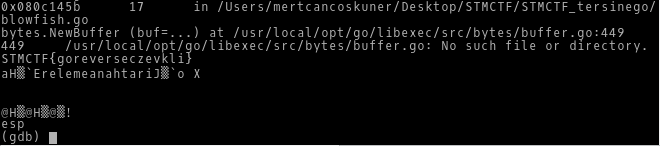

I'm going to use [PINCE](https://github.com/korcankaraokcu/PINCE) for this challenge
### The proper way
As usual, set a breakpoint at the `main`(or `main.main` in our case)

  

Apparently, `main.main` calls `main.FLAG_NATIVE_BLOWFISH_ENCRYPTION`, stepping into that

  

It calls `runtime.stringtoslicebyte` with the parameter `sifrelemeanahtari` to convert that string into a bytearray

  

Then `NewCipher` is called with that bytearray to create a new cipher

  

Then `Decrypt` is called with that cipher and bytearray

  

`Decrypt` is called once again with the cipher and the return value of the last `Decrypt` call

  

`Decrypt` is called for the last time with the cipher and the return value of the last `Decrypt` call

  

Stepping out of the last `Decrypt` call reveals our flag  
So the psuedocode would probably look like this:
```
key="sifrelemeanahtari"
bytes=stringtoslicebyte(key)
cipher=NewCipher(bytes)
v1=Decrypt(cipher, bytes)
v2=Decrypt(cipher, v1)
v3=Decrypt(cipher, v2)  # v3 is our flag
```
### The automated way
Using [CTF-Tools](https://github.com/korcankaraokcu/CTF-Tools)

  


