We are provided with an executable and a driver. The executable loads the driver into kernel space and then uses the "Crackme" device to communicate. Executable sends the user input via "Crackme" device and the driver returns the corresponding encrypted data by using the same device.

Executable side:

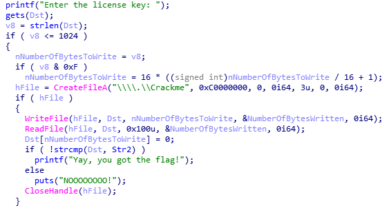

Driver side:

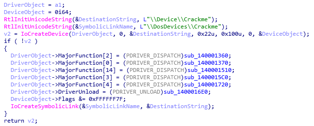

Finally, the executable compares the encrypted user input with the encrypted flag.

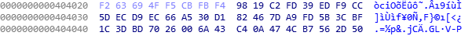

IRP processing(user input processing) starts at the function `sub_140001720`

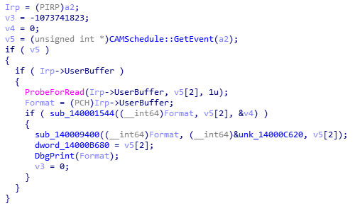

Stepping through the function lead me to the place where the encryption begins, `sub_140001D68`

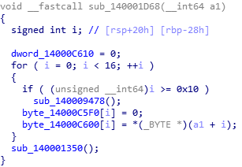

`sub_140001350` modifies the return address so it can jump to the hidden encryption function. We'll put a breakpoint at here.

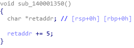

You need a VM, a bridge and a kernel debugger to follow along with this writeup. In my case, I've used VMware(Win 7), VirtualKD and IDA Pro(windbg). This article can help you to prepare this setup easily:
- https://www.hexblog.com/?p=123

You also need to enable test signed drivers:
- https://docs.microsoft.com/en-us/windows-hardware/drivers/install/the-testsigning-boot-configuration-option

Attach your debugger to the kernel and execute the binary as administrator. After launching, the binary will load the driver to the kernel space.

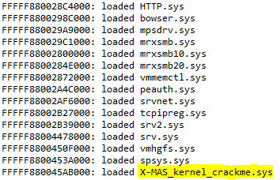

To put a breakpoint at `sub_140001350`, we must calculate its address first. It's offset is 1350, so we must add 1350 to the base: FFFFF880045AB000+1350=FFFFF880045AC350

Go the address, convert it to code, then to a function. Finally, pseudocode should give you something like this:

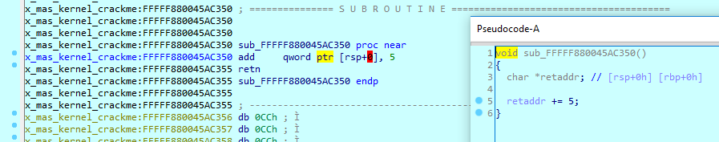

Stepping through it will lead us to a huge jump table.


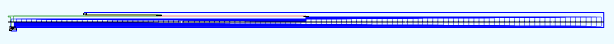

But fear not, for I, the most curious boi there is, have analysed all of them, so you wont have to. This jump table basically has 12 distinct functions and it loops them every 12 function calls, so it calls them once per loop. Loop repeats itself for 11 times, for every line(16 bytes) in `off_FFFFF880045B7540`:

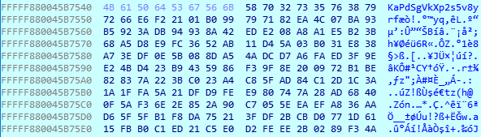

I've gathered all of my findings in [kernel_functions.txt](kernel_functions.txt). I've even started writing a solver for this monstrosity, you can find it in [X-MAS_kernel_crackme.py](X-MAS_kernel_crackme.py)

But then, I've realized there's one function that makes writing a solver script very hard without bruteforcing:

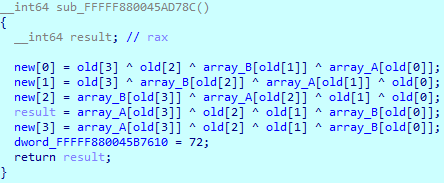

Since it requires 32 bits of the user input per function, this equation takes way too much time to bruteforce. So I started to look for something else.

Eventually, a pattern in the `array_A` caught my eye:

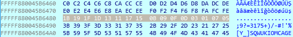

Searching it online lead me to this piece of code:
- https://rdrr.io/cran/rngSetSeed/src/tests/compareToRScriptAES.R

Could it be... AES?


At first, I couldn't tell which part of the algorithm was AES and which part was not. But [@kaanezder](https://twitter.com/kaanezder) was able to tell that the entire algorithm, the whole thing was AES and the key was the first 16 bytes of `off_FFFFF880045B7540`, kudos to him for helping me out.

So, if we decrypt the flag with the the key, we get our flag:
```python
In [8]: key = "\x4B\x61\x50\x64\x53\x67\x56\x6B\x58\x70\x32\x73\x35\x76\x38\x79"

In [9]: cipher = AES.new(key, AES.MODE_ECB)

In [10]: cipher.decrypt('\xF2\x63\x69\x4F\xF5\xCB\xFB\xF4\x98\x19\xC2\xFD\x39\xED\xF9\xCC\x5D\xEC\xD9\xEC\x66\xA5\x30\xD1\x82\x46\x7D\xA9\xFD\x5B\x3C\xBF\x1C\x3D\xBD\x70\x26\x00\x6A\x43\xC4\x0A\x47\x4C\xB7\x56\x2D\x50')

Out[10]: 'X-MAS{060b192f0063cc9ab6361c2329687506f50321d8}\x00'
```
